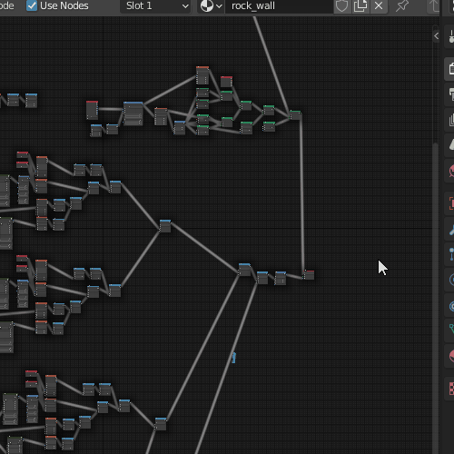
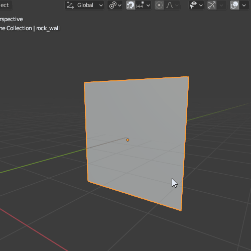

### Bake Texture Tool

This tool helps you quickly bake image texture from the Shader Editor.

Please select 32 bit Float when creating images for use with Terrain Nodes to 
prevent 'stepping' artifacts.

:::important
The selected object must be a flat plane with an unwrapped UV.

:::