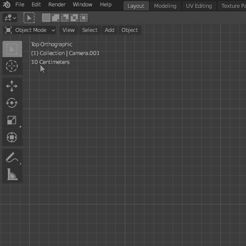
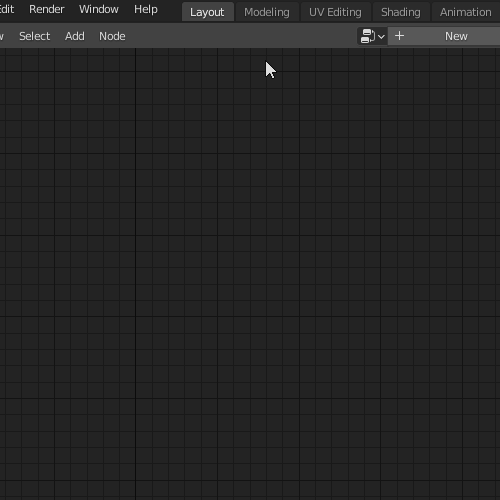
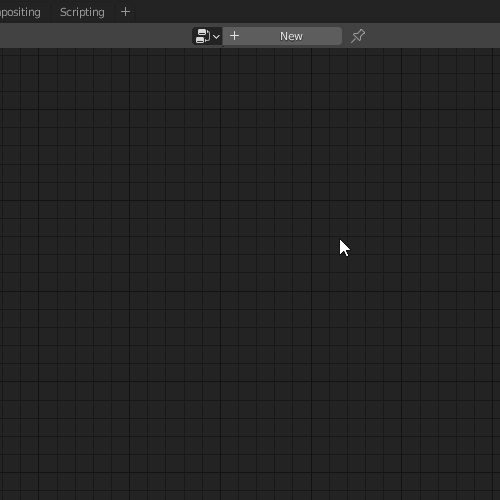
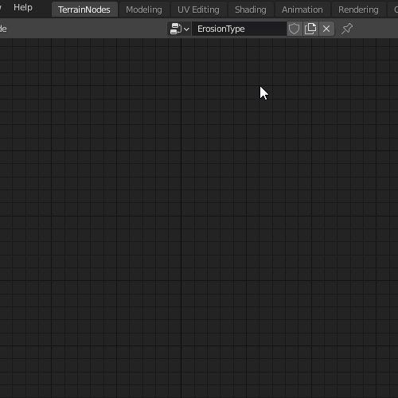

### Installation

- Make sure to have Blender 2.91 or above installed, you can get it [here](www.blender.org)

- Download Terrain Nodes add-on zip file ( **DO NOT UNZIP** )

- Open Blender and go to **Edit** > **Preferences** > **Install** navigate to where you have downloaded Terrain Nodes 
zip file, select it and click **Install Add-on**. It should be enabled by default after installation, if not enable it.

### First Steps

After installing the add-on you will not see any changes. To open Terrain Nodes node editor go to Editor Type and 
select Terrain Nodes under "General" column.



```Optional:``` Change layout name to Terrain Nodes.



Next create new Node Group (or select an existing one you saved).



:::caution

#### Make sure to select Fake user, otherwise your node setup will be lost!

:::



