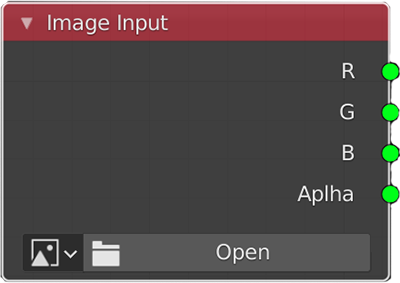
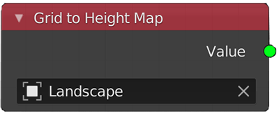
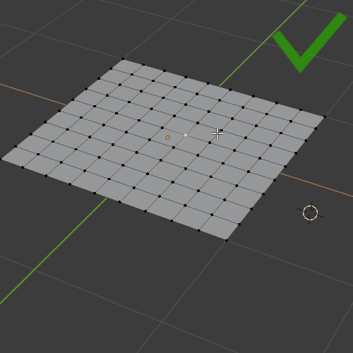
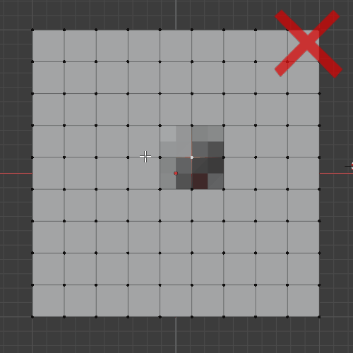
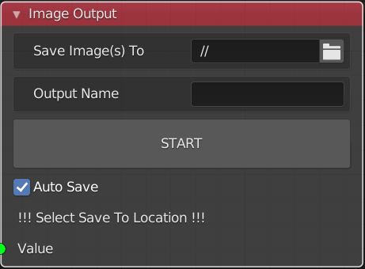
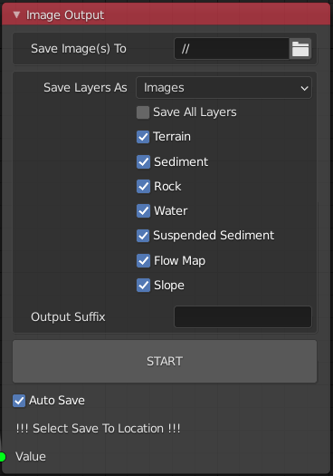
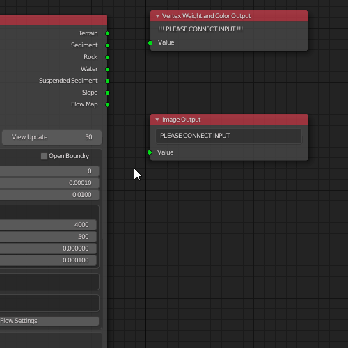
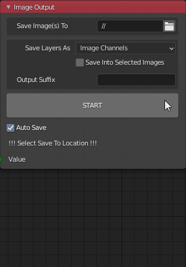

Terrain Nodes works on image data and outputs results either as images or / and as 
vertex weights / colors to a grid object.

### Image Input Node

The Image Input node is very simple, if your image is just grayscale data then all four outputs will be same.
Note that if the image you are using is on the hard drive and it has been updated this change will be detected
automatically, causing the node tree execution to restart from that Image Node.

### Grid to Height Map Node

This node converts grid object (vertex z value) to single channel image data. Such as an [ANT Landscape](https://youtu.be/f9OxD3qbSiM?t=36) object.

### What is a grid object in Terrain Nodes?

A grid has equal spacing (edge length) in the X and Y direction. A grid has an equal
number of vertices on all sides. If you take a plane with only 4 vertices and subdivide it
(using **Simple** type), that is still a grid object, because all those rules will be met. The only displacement
is allowed in the Z axis. So, if you look at a grid from the top, you will not see any
vertices out of place, but if you look from the side you will see the displacement.

#### Only z axis movement of vertices is ok (you can lock to only use z axis in sculpt mode as well):

#### Everything else will break grid import:

Scaling the entire grid in just 'Y' or 'X' axis as seen here is not safe either.

### Image Output Node
Image Output node will convert Terrain Nodes data into an image format and save it to disc.

Image Output node interface will change depending on the input node. Currently Erosion Node has
a specific relationship with the Output Image and Output Grid nodes. This is because Erosion Node
has several outputs for different layers. So to save all layers at the same time and possibly in the same
image file (as sepparate channels), the Output Node will change interface to the following.

As you can see all of the layers correspond to Erosion Node outputs, however Image Output and Grid Output nodes
only need to be connected to any one of them like so:

All of the above connection changes result in the same output.

#### Output Options

When saving layers from the Erosion Node you can save each layer as an individual image 
(so RGB will all have the same value). Or you can pack all of the layers into image channels.
The way Terrain Nodes handles this is it generates two image files stwr.exr and susf.exr. Each image 
contains the following layers in this exact order:

#### stwr.exr
- Sediment
- Terrain
- Water
- Rock

#### susf.exr
- Suspended Sediment
- Slope
- Flow Map
- This layer is 1.0 by default as it is currently empty.

You can switch between individual images and packed image channels as output:

You define an Output Suffix that will append to the default names created by Terrain Nodes.

:::caution

#### If you check auto save the images in the folder with the same name will be overwritten!

:::